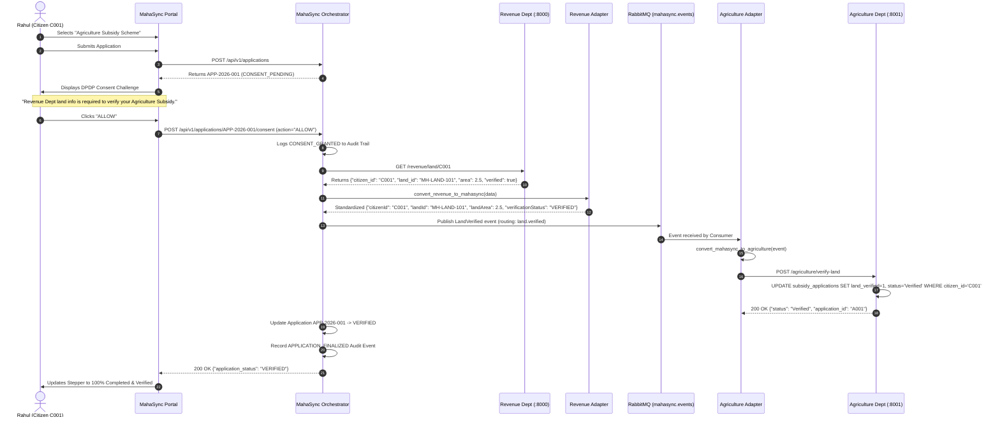

# MAHASync Architecture Diagrams (Member 6)

## 1. High-Level Interoperability Architecture
```mermaid
flowchart TD
    subgraph Citizen Layer
        Citizen["👤 Citizen (Rahul - C001)"]
        UI["🌐 MahaSync Citizen Portal<br/>(Next.js / Port 3000 or 8082)<br/>Dashboard • Consent • Stepper"]
    end

    subgraph Security & IAM
        Keycloak["🔐 Keycloak IAM (Port 8080)<br/>Realm: mahasync | User: rahul<br/>OIDC Tokens & Consent Scope"]
    end

    subgraph Interoperability Core [MahaSync Backend - Port 8082]
        Gateway["⚡ FastAPI Interoperability Gateway"]
        ConsentEngine["⚖️ DPDP Consent & State Engine"]
        Orchestrator["🔄 Data Exchange Orchestrator"]
        AuditLog["📜 Immutable Audit Trail Engine<br/>(PostgreSQL / SQLite)"]
        AIAssistant["🤖 MahaMitra AI Government Assistant"]
    end

    subgraph Adapters & Event Bus
        RevAdapter["🔄 Revenue Adapter<br/>(revenue_adapter.py)"]
        AgriAdapter["🔄 Agriculture Adapter<br/>(agriculture_adapter.py)"]
        RabbitMQ["📨 RabbitMQ Event Bus (Port 5672)<br/>Exchange: mahasync.events<br/>Queue: agriculture.land_verified"]
    end

    subgraph Independent Government Systems
        subgraph Revenue Department [Port 8000]
            RevAPI["🏛️ Revenue API (FastAPI)"]
            RevDB[("💾 revenue.db<br/>(land_records)")]
            RevPortal["🖥️ Revenue Dept Portal<br/>(/revenue/portal)"]
            RevAPI <--> RevDB
            RevPortal <--> RevDB
        end

        subgraph Agriculture Department [Port 8001]
            AgriAPI["🌾 Agriculture API (FastAPI)"]
            AgriDB[("💾 agriculture.db<br/>(subsidy_applications)")]
            AgriPortal["🖥️ Agriculture Dept Portal<br/>(/agriculture/portal)"]
            AgriAPI <--> AgriDB
            AgriPortal <--> AgriDB
        end
    end

    Citizen -->|1. Authenticate / Login| UI
    UI <-->|2. OIDC Token / Identity| Keycloak
    UI -->|3. Apply Agriculture Subsidy| Gateway
    Gateway --> ConsentEngine
    ConsentEngine -->|4. Request Explicit Consent| UI
    Citizen -->|5. Grant Consent (ALLOW)| ConsentEngine
    ConsentEngine -->|6. Log Consent Artifact| AuditLog
    ConsentEngine --> Orchestrator
    Orchestrator -->|7. Query 7/12 Land Record| RevAPI
    RevAPI -->|8. Raw Revenue JSON| RevAdapter
    RevAdapter -->|9. Standard MahaSync JSON| Orchestrator
    Orchestrator -->|10. Publish LandVerifiedEvent| RabbitMQ
    RabbitMQ -->|11. Consume Event| AgriAdapter
    AgriAdapter -->|12. Standardized Agriculture Payload| AgriAPI
    AgriAPI -->|13. Update A001 -> VERIFIED| AgriDB
    AgriAPI -->|14. Status Confirmation| Orchestrator
    Orchestrator -->|15. Finalize APP-2026-001 -> VERIFIED| AuditLog
    AuditLog -->|16. Real-time Stepper Update| UI
```

---

## 2. End-to-End Interoperability Sequence Flow


---

## 3. Data Transformation & Canonical Model
```text
[Revenue Department Model]
{
  "citizen_id": "C001",
  "citizen_name": "Rahul",
  "land_id": "MH-LAND-101",
  "area": 2.5,
  "verified": true
}
              │
              ▼ convert_revenue_to_mahasync()
[Canonical MahaSync Model]
{
  "citizenId": "C001",
  "landId": "MH-LAND-101",
  "landArea": 2.5,
  "verificationStatus": "VERIFIED"
}
              │
              ▼ convert_mahasync_to_agriculture()
[Agriculture Department Model]
{
  "applicantId": "C001",
  "propertyNumber": "MH-LAND-101",
  "landArea": 2.5,
  "verificationStatus": "VERIFIED"
}
```
